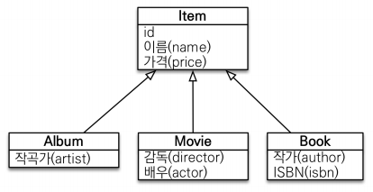
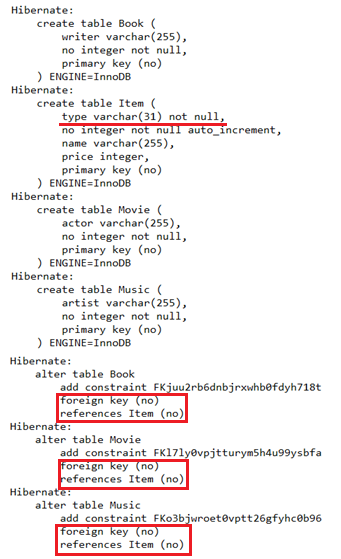
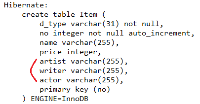
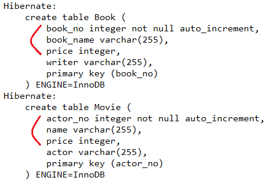

# [JPA BASIC] 2. Entity and Mapping

<!--more-->
<!-- Table of contents -->
* this unordered seed list will be replaced by the toc
{:toc}

<!-- text -->

## 엔티티 매핑 소개
- 객체와 테이블 매핑: @Entity, @Table
- 필드와 컬럼 매핑: @Column
- 기본 키 매핑: @Id
- 연관관계 매핑: @ManyToOne, @JoinColumn 

## @Entity
- @Entity가 붙은 클래스는 JPA가 관리, 엔티티라 한다.
- JPA를 사용해서 테이블과 매핑할 클래스는 @Entity 필수

## @Table
> Java 엔티티와 DB 테이블의 네이밍 차이 해결을 위해 name 속성을 주로 사용. 나머지는 많이 사용하지 않는 듯하다.

- name : 매핑할 테이블 이름
- catalog : 데이터베이스 catalog 매핑
- schema : 데이터베이스 schema 매핑
- uniqueConstraints(DDL) : DDL 생성 시에 유니크 제약 조건 생성

### 주의
- 기본 생성자 필수(파라미터가 없는 public 또는 protected 생성자)
- final 클래스, enum, interface, inner 클래스 사용X
- 저장할 필드에 final 사용 X
- hibernate.hbm2ddl.auto : DDL 자동 생성은 되도록 사용 지양(기본 none 사용 권장)

## Entity 내에 사용되는 어노테이션

``` java
@Entity
public class Member {
    @Id
    private Long id;
    @Column(name = "name") 
    private String username;
    private Integer age;
    @Enumerated(EnumType.STRING) // 주의! 기본값인 EnumType.ORDINAL 사용X(순서가 바뀔경우 망함)
    private RoleType roleType;
    @Temporal(TemporalType.TIMESTAMP) // 옵션으로 DATE, TIME, TIMESTAMP 가 있음
    private Date createdDate;
    @Temporal(TemporalType.TIMESTAMP) 
    private Date lastModifiedDate;
    @Lob
    private String description; 
    @Transient
    private String tmpValues; // DB연관X, 임시로 어떤 값을 보관하고 싶을 때 사용
    //Getter, Setter…
}
```

### 기본키
- 직접 할당: @Id만 사용
- 자동 생성(@GeneratedValue)
  - IDENTITY: 데이터베이스에 위임(MySQL과 SQL Server 에서 주로 사용 AUTO_ INCREMENT)
  - SEQUENCE: 데이터베이스 시퀀스 오브젝트 사용( Oracle, PostgreSQL, H2 에서 주로 사용)
    - @SequenceGenerator 필요
  - TABLE: 키 생성용 테이블 사용, 모든 DB에서 사용(다른 전략을 사용할 수 없는 경우 마지막 수단으로 사용)
    - @TableGenerator 필요
  - AUTO: 방언에 따라 자동 지정, 기본값

``` java
// IDENTITY 전략 - 매핑
@Entity
public class Member {
    @Id
    @GeneratedValue(strategy = GenerationType.IDENTITY) 
    private Long id;

// SEQUENCE 전략 - 특징
@Entity
@SequenceGenerator(
    name = "MEMBER_SEQ_GENERATOR",
    sequenceName = "MEMBER_SEQ", //매핑할 데이터베이스 시퀀스 이름 
    initialValue = 1, allocationSize = 1)
public class Member {
    @Id
    @GeneratedValue(strategy = GenerationType.SEQUENCE, generator = "MEMBER_SEQ_GENERATOR") 
    private Long id;

// TABLE 전략 - 매핑(단점 성능..)
// create table MY_SEQUENCES (
//  sequence_name varchar(255) not null, 
//  next_val bigint,
//  primary key ( sequence_name ) 
// )
@Entity
@TableGenerator(
    name = "MEMBER_SEQ_GENERATOR", 
    table = "MY_SEQUENCES",
    pkColumnValue = "MEMBER_SEQ", allocationSize = 1) 
public class Member {
    @Id
    @GeneratedValue(strategy = GenerationType.TABLE, generator = "MEMBER_SEQ_GENERATOR")
    private Long id;

```

### 권장하는 식별자 전략
- 기본 키 제약 조건: null 아님, 유일, 변하면 안된다.
- 미래까지 이 조건을 만족하는 자연키는 찾기 어렵다. 대리키(대체키)를 사용하자.
- 예를 들어 주민등록번호도 기본 키로 적절하기 않다.
- 권장: Long형 + 대체키 + 키 생성전략 사용

## Entity간 연관관계 맵핑
> JPA는 @ManyToOne, @OneToMany, @OneToOne, @ManyToMany 어노테이션으로 연관 관계를 매핑하고, 연관 관계의 주인이 외래 키를 관리한다.(등록, 수정)  
> 연관 관계의 주인은 주로 'Many' 쪽에 설정하며, 다음과 같이 사용한다.(또는 외래 키가 있는 있는 곳)  
> 일대다에서 일쪽은 @JoinColumn을 필수로 설정해야 한다. 그렇지 않으면 조인 테이블 방식을 사용함(중간에 테이블을 하나 추가함)  
> 다대다 관계는 배우지도 말자, 연결 테이블을 엔티티로 승격하여 사용.

``` java
    @ManyToOne
    @JoinColumn(name = "TEAM_ID") 
    private Team team;
```
> 사용 여부에 따라 반대편도 아래와 같이 설정할 수 있다. (확실하지 않을 경우 일반적으로 미리 설정해 둔다)  

``` java
    @OneToMany(mappedBy = "team")
    List<Member> members = new ArrayList<Member>();
```

### 주의
> 양방향 매핑시 연관관계의 주인에 값을 입력해야 한다.(실수 많이 함)

``` java
    Team team = new Team(); 
    team.setName("TeamA"); 
    em.persist(team);

    Member member = new Member(); 
    member.setName("member1");

    team.getMembers().add(member); 
    //연관관계의 주인에 값 설정
    member.setTeam(team); //** 

    em.persist(member);
```

## 상속관계 매핑

> 슈퍼타입 서브타입 논리 모델을 실제 물리 모델로 구현하는 방법  
> 부모 엔티티와 자식 엔티티가 필요할때 사용  


### 주요 어노테이션

- @Inheritance(strategy=InheritanceType.XXX) 
  - JOINED: 조인 전략(말 그대로 나눠서 조인)
  - SINGLE_TABLE: 단일 테이블 전략(하나의 테이블에 다 때려 박기)
  - TABLE_PER_CLASS: 구현 클래스마다 테이블 전략(아무 관계없이 테이블 만들기. 이건 안씀)
- @DiscriminatorColumn(name="DTYPE")
- @DiscriminatorValue("XXX")

``` java
@Entity
@Inheritance(strategy = InheritanceType.JOINED)	// 여기 들어가는 옵션에 따라 테이블이 생성 된다.
@DiscriminatorColumn(name="type")		// 구분 하는 칼럼	
public abstract class Item {
	@Id
	@GeneratedValue(strategy=GenerationType.IDENTITY)
	@Column(name="no")
	private Integer no;
	
	@Column(name="name")
	private String name;
	
	@Column(name="price")
	private Integer price;
}


@Entity
@DiscriminatorValue("movie")
public class Movie extends Item{
	private String actor;
}


@Entity
@DiscriminatorValue("music")
public class Music extends Item{
	private String artist;
}


@Entity
@DiscriminatorValue("book")
public class Book extends Item{
	private String writer;
}
```
#### JOINED


#### SINGLE_TABLE



### @MappedSuperclass

> 공통 매핑 정보가 필요할 때 사용  
> 상속 관계에는 있지만 엔티티에는 영향을 주기 싫은 경우 사용(부모 엔티티가 따로 만들어지는걸 원하지 않음)  


- 상속관계 매핑X
- 엔티티X, 테이블과 매핑X
- 부모 클래스를 상속 받는 자식 클래스에 매핑 정보만 제공
- 조회, 검색 불가(em.find(BaseEntity) 불가)
- 직접 생성해서 사용할 일이 없으므로 추상 클래스 권장
- 테이블과 관계 없고, 단순히 엔티티가 공통으로 사용하는 매핑 정보를 모으는 역할
- 주로 등록일, 수정일, 등록자, 수정자 같은 전체 엔티티에서 공통으로 적용하는 정보를 모을 때 사용
- 참고: @Entity 클래스는 엔티티나 @MappedSuperclass로 지정한 클래스만 상속 가능

``` java
@MappedSuperclass
public abstract class Item {
	@Id
	@GeneratedValue(strategy=GenerationType.IDENTITY)
	@Column(name = "no")
	private Integer no;
	
	@Column(name = "name")
	private String name;
	
	@Column(name = "price")
	private Integer price;
}


@Entity
@AttributeOverride(name="no", column=@Column(name="actor_no"))
public class Movie extends Item{
	private String actor;
}


@Entity
@AttributeOverrides({
	@AttributeOverride(name="no", column=@Column(name="book_no")),
	@AttributeOverride(name="name", column=@Column(name="book_name"))
})
public class Book extends Item{
	private String writer;
}
```

