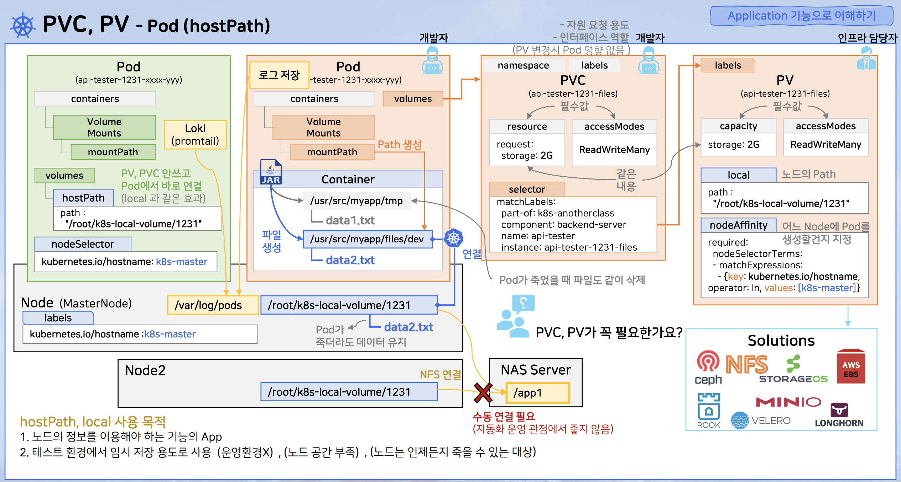

# Application 기능으로 이해하기 - PV/PVC, Deployment, Service, HPA

<!--more-->
<!-- Table of contents -->
* this unordered seed list will be replaced by the toc
{:toc}

<!-- text -->

## PV/PVC (local, hostPath)
- 용도
  - 파드가 여러 이유로 인해 종료될 경우에 대비해 보존해야 할 데이터를 관리하기 위함
  - PV/PVC를 활용해 파드가 죽어 컨테이너가 종료된다고 하더라도, 쿠버네티스가 재생성한 파드를 다시 PV/PVC와 연결해 데이터 조회 가능
- 의미
  - 파드와 볼륨의 결합도를 낮추기 위함
    - 파드는 개발자가 관리하며, PV는 인프라 담당자가 관리하기 때문
    - 파드-PV 중간에 PVC가 있는 이유는 PV 관련 다양한 솔루션에 종속되지 않도록 인터페이스 역할을 수행하기 위함

## local, hostPath

- local
  - PV(Persistent Volume)이 노드에 마운트된 로컬 스토리지 디바이스
  - nodeAffinity를 통해 어떤 노드에 파드를 생성(스케줄링)할지 지정
    - nodeAffinity 속성이 있는 PV와 연결된 파드는 그림에서 Master Node에 생성
    - Master Node의 path와 파드 내의컨테이너 디렉토리를 매핑
- hostPath
  - 노드의 파일시스템에 있는 파일이나 디렉터리를 파드에 마운트
    - 노드에 있는 정보를 애플리케이션에서 조회하는 용도로 사용
      - Promtail이 Loki가 수집하는 로그를 hostPath를 활용해 특정 디렉토리에 저장하기 때문에 모든 파드의 로그를 Loki를 통해 확인 가능
    - 사용의 편리함으로 인해 테스트 환경에서 임시 저장 용도로도 사용되기는 함
      - 노드 공간이 부족해질 수 있기 때문에 운영환경에서는 사용 금지
      - 우회 방법이 있기는 하지만(그림에서는 NAS 서버를 활용) 자동화가 힘들기 때문에 지양할 것
  - PV/PVC local 속성과 유사한 기능을 제공하나, 더욱 간단하게 사용 가능
  - 쿠버네티스 공식 문서에서 사용하지 않는걸 권장하고 있음