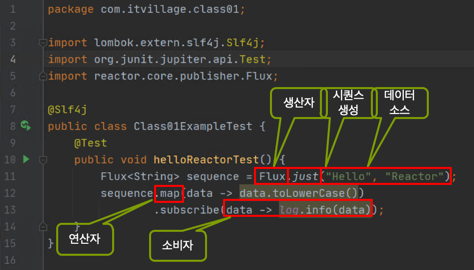

# [Spring-Reactive] Reactor (Mono and Flux)

<!--more-->
<!-- Table of contents -->
* this unordered seed list will be replaced by the toc
{:toc}

<!-- text -->

## Reactor 용어 정의
- Publisher : 발행자, 게시자, 생산자, 방출자(Emitter)
- Subscriber : 구독자, 소비자
- Emit : Publisher가 데이터를 내보내는 것(방출하다. 내보내다. 통지하다.)
- Sequence : Publisher가 emit하는 데이터의 연속적인 흐름을 정의 해 놓은 것. Operator 체인형태로 정의 된다.
- Subscribe : Subscriber가 Sequence를 구독하는 것
- Dispose : Subscriber가 Sequence 구독을 해지 하는 것




## Publisher
> Mono와 Flux에 대해 알아본다.

### Mono
- 0개 또는 1개의 데이터를 emit하는 Publisher이다.(Compare with RxJava Maybe)
- 데이터 emit 과정에서 에러가 발생하면 onError signal을 emit한다.

```java
package com.itvillage.section03.class01;

import com.itvillage.utils.Logger;
import com.jayway.jsonpath.DocumentContext;
import com.jayway.jsonpath.JsonPath;
import org.springframework.http.HttpEntity;
import org.springframework.http.HttpHeaders;
import org.springframework.http.HttpMethod;
import org.springframework.http.MediaType;
import org.springframework.web.client.RestTemplate;
import org.springframework.web.util.UriComponentsBuilder;
import reactor.core.publisher.Mono;

import java.net.URI;
import java.util.Collections;

/**
 * Mono 활용 예제
 *  - worldtimeapi.org Open API를 이용해서 서울의 현재 시간을 조회한다.
 */
public class MonoExample03 {
    public static void main(String[] args) {
        URI worldTimeUri = UriComponentsBuilder.newInstance().scheme("http")
                .host("worldtimeapi.org")
                .port(80)
                .path("/api/timezone/Asia/Seoul")
                .build()
                .encode()
                .toUri();

        RestTemplate restTemplate = new RestTemplate();
        HttpHeaders headers = new HttpHeaders();
        headers.setAccept(Collections.singletonList(MediaType.APPLICATION_JSON));


        Mono.just(
                restTemplate.exchange(worldTimeUri, HttpMethod.GET, new HttpEntity<String>(headers), String.class)
        )
                .map(response -> {
                    DocumentContext jsonContext = JsonPath.parse(response.getBody());
                    String dateTime = jsonContext.read("$.datetime");
                    return dateTime;
                })
                .subscribe(
                        data -> Logger.info("# emitted data: " + data),
                        error -> {
                            Logger.onError(error);
                        },
                        () -> Logger.info("# emitted onComplete signal")
                );

    }
}
```


### Flux
- 0 개 ~ N 개의 데이터를 emit하는 Publisher이다.
- 데이터 emit 과정에서 에러가 발생하면 onError signal을 emit한다.

```java
// ex 1
public class FluxExample01 {
    public static void main(String[] args) {
        Flux.just(6, 9, 13)
                .map(num -> num % 2)
                .subscribe(remainder -> Logger.info("# remainder: {}", remainder));
    }
}

// ex 2
public class FluxExample02 {
    public static void main(String[] args) {
        Flux.fromArray(new Integer[]{3, 6, 7, 9})
                .filter(num -> num > 6)
                .map(num -> num * 2)
                .subscribe(multiply -> Logger.info("# multiply: {}", multiply));
    }
}

// ex 3
public class FluxExample03 {
    public static void main(String[] args) {
        Flux<Object> flux =
                Mono.justOrEmpty(null)
                        .concatWith(Mono.justOrEmpty("Jobs"));
        flux.subscribe(data -> Logger.info("# result: {}", data));
    }
}

// ex 4
public class FluxExample04 {
    public static void main(String[] args) {
        Flux.concat(
                Flux.just("Venus"),
                Flux.just("Earth"),
                Flux.just("Mars"))
            .collectList()
            .subscribe(planetList -> Logger.info("# Solar System: {}", planetList));
    }
}

```